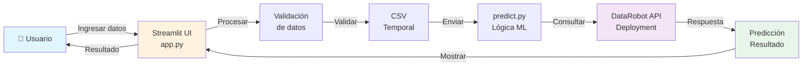
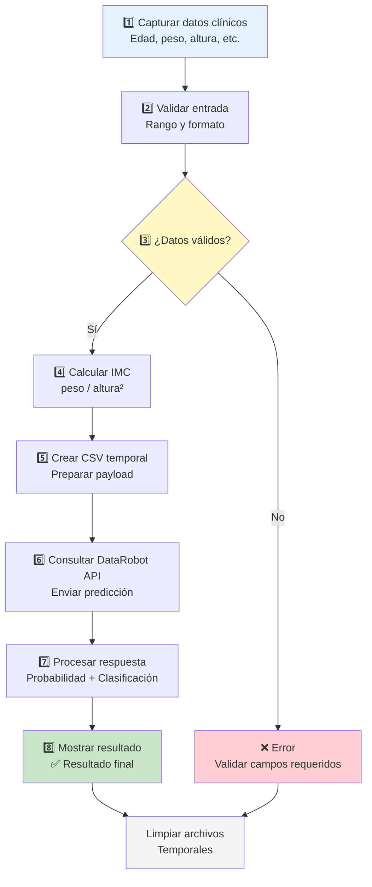
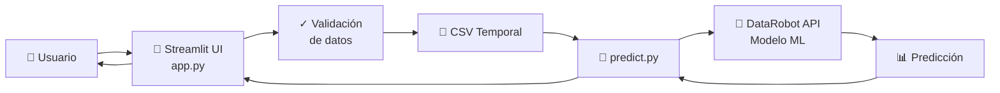
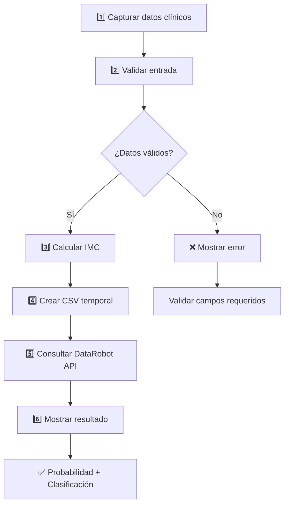

# 🫀 Cardiovascular Risk Prediction with DataRobot

[](https://www.python.org/)
[](https://streamlit.io/)
[](https://www.datarobot.com/)
[](LICENSE)

Aplicación web interactiva desarrollada en **Python** y **Streamlit** que permite estimar el riesgo de enfermedad cardiovascular mediante un modelo de Machine Learning desplegado en la plataforma **DataRobot**. El sistema captura variables clínicas del paciente, calcula automáticamente indicadores de salud como el IMC y genera predicciones en tiempo real con alta precisión.

## 📋 Tabla de Contenido

- [📖 Descripción](#descripción)
- [🏗️ Arquitectura](#arquitectura)
- [🔄 Flujo de Predicción](#flujo-de-predicción)
- [✨ Características](#características)
- [🚀 Tecnologías](#tecnologías)
- [📁 Estructura del Proyecto](#estructura-del-proyecto)
- [⚙️ Instalación](#instalación)
- [🔐 Configuración](#configuración)
- [▶️ Ejecución](#ejecución)
- [📊 Variables del Modelo](#variables-del-modelo)
- [📈 Uso](#uso)
- [🔮 Futuras Mejoras](#futuras-mejoras)
- [🤝 Contribución](#contribución)
- [📄 Licencia](#licencia)
- [👩‍💻 Autor](#autor)
📖 Descripción

La aplicación permite a profesionales de la salud ingresar datos clínicos de un paciente de forma segura e intuitiva. El sistema:

1. **Captura datos** del paciente (edad, género, medidas antropométricas, etc.)
2. **Calcula automáticamente** indicadores como el Índice de Masa Corporal (IMC)
3. **Envía información** al modelo de Machine Learning en DataRobot
4. **Genera predicciones** en tiempo real del riesgo cardiovascular

### Variables clínicas analizadas

- Edad (años)
- Género
- Estatura (cm)
- Peso (kg)
- Índice de Masa Corporal (IMC)
- Presión arterial sistólica (mmHg)
- Presión arterial diastólica (mmHg)
- Colesterol (categórico)
- Glucosa (categórico)
- Consumo de tabaco (binario)
- Consumo de alcohol (binario)
- Actividad física (binario)
## 🏗️ Arquitectura

### 🧠 Diagrama de Arquitectura

**Imagen del repositorio:**

[](https://github.com/LillianaU/cardiovascular-risk-prediction-datarobot/blob/main/docs/diagrams/arquitectura.png)

**Versión interactiva (Mermaid para GitHub):**



### Componentes principales

| Componente | Tecnología | Responsabilidad |
|-----------|-----------|------------------|
| **Frontend** | Streamlit | Interfaz de usuario y captura de datos |
| **Backend** | Python | Lógica de validación y procesamiento |
| **ML Model** | DataRobot API | Predicciones de riesgo cardiovascular |
| **Storage** | CSV | Almacenamiento temporal de datos |

---

## 🔄 Flujo de Predicción

### 📋 Diagrama del Proceso

**Imagen del repositorio:**

[](https://github.com/LillianaU/cardiovascular-risk-prediction-datarobot/blob/main/docs/diagrams/flujo.png)

**Versión interactiva (Mermaid - Recomendado para GitHub):**



### Detalles del flujo

| Paso | Descripción | Validación | Salida |
|------|-----------|-----------|--------|
| 1 | Captura de datos clínicos | Campos requeridos | Diccionario de datos |
| 2 | Validación de entrada | Rangos, tipos, unidades | Datos validados |
| 3 | Control de calidad | ¿Todos los datos son correctos? | Decisión (Sí/No) |
| 4 | Cálculo automático | IMC = peso / (altura²) | IMC calculado |
| 5 | Preparación de datos | Formato CSV | Archivo temporal |
| 6 | Llamada API | Conexión a DataRobot | Respuesta JSON |
| 7 | Procesamiento de resultado | Extraer probabilidad | Predicción final |
| 8 | Presentación | Formato visual | Resultado a usuario |
✨ Características
✅ Interfaz amigable con Streamlit
🧮 Cálculo automático de IMC
🔎 Validación de datos clínicos
🤖 Integración con DataRobot API
⚡ Predicción en tiempo real
📊 Visualización de probabilidad de riesgo
🧹 Manejo de archivos temporales
🧱 Arquitectura desacoplada
🚀 Tecnologías
🐍 Lenguaje principal
Python
🎈 Desarrollo web
Streamlit
📊 Procesamiento de datos
Pandas
🤖 Inteligencia Artificial
DataRobot
Machine Learning
📄 Formato de datos
CSV
📁 Estructura del Proyecto
cardiovascular-risk-app/
│
├── app.py
├── predict.py
├── requirements.txt
├── README.md
│
└── .streamlit/
    └── secrets.toml
⚙️ Instalación
1️⃣ Clonar repositorio
git clone https://github.com/usuario/cardiovascular-risk-app.git
cd cardiovascular-risk-app
2️⃣ Crear entorno virtual
python -m venv venv

Activar:

Windows:

venv\Scripts\activate

Mac/Linux:

source venv/bin/activate
3️⃣ Instalar dependencias
pip install -r requirements.txt
🔐 Configuración

Crear archivo:

.streamlit/secrets.toml

Contenido:

DATAROBOT_API_KEY="TU_API_KEY"
DATAROBOT_DEPLOYMENT_ID="TU_DEPLOYMENT_ID"
DATAROBOT_HOST="https://app.datarobot.com"
▶️ Ejecución
streamlit run app.py
📊 Variables del Modelo
Variable	Tipo
genero	Numérica
edad_anios	Numérica
estatura_cm	Numérica
peso_kg	Numérica
indice_masa_corporal	Numérica
presion_sistolica	Numérica
presion_diastolica	Numérica
colesterol	Categórica
glucosa	Categórica
fuma	Binaria
consume_alcohol	Binaria
actividad_fisica	Binaria
📈 Resultados

La aplicación retorna:

📊 Probabilidad de riesgo cardiovascular
🧠 Clasificación (alto / bajo riesgo)
📄 Respuesta del modelo DataRobot
Ejemplo:
Probabilidad: 84.35%
Resultado: Alto riesgo cardiovascular
🔮 Futuras Mejoras
📊 Dashboard analítico avanzado
🧾 Historial de pacientes
🗄️ Integración con base de datos
🔐 Autenticación de usuarios
🐳 Dockerización del proyecto
☁️ Despliegue en la nube
🧠 Explainable AI (XAI)
🌐 DataRobot

🔗 https://app.datarobot.com/homepage/main

👩‍💻 Autor

Lilliana Uribe
Proyecto académico enfocado en Machine Learning, Analítica Predictiva y despliegue de modelos con DataRobot y Streamlit.

🚀 Si quieres siguiente nivel

Puedo ayudarte a convertir esto en:

README tipo empresa (IBM / Google style)
versión con banner + logo + portada visual
README optimizado para portafolio LinkedIn
o repositorio listo para entrevista técnica

Solo dime 👍

crea el documento para descargar .md
Analizado
# Create README.md file content

content = """# 🫀 Cardiovascular Risk Prediction with DataRobot

Aplicación web desarrollada en **Python y Streamlit** que permite estimar el riesgo de enfermedad cardiovascular mediante un modelo de **Machine Learning desplegado en DataRobot**.

El sistema captura variables clínicas del paciente, calcula automáticamente el **Índice de Masa Corporal (IMC)** y genera una predicción en tiempo real del riesgo cardiovascular.

---

# 📋 Tabla de Contenido

- 📖 Descripción
- 🏗️ Arquitectura
- 🔄 Flujo de Predicción
- ✨ Características
- 🚀 Tecnologías
- 📁 Estructura del Proyecto
- ⚙️ Instalación
- 🔐 Configuración
- ▶️ Ejecución
- 📊 Variables del Modelo
- 📈 Resultados
- 🔮 Futuras Mejoras
- 👩‍💻 Autor

---

## 📖 Descripción

La aplicación permite ingresar datos clínicos de un paciente, calcular automáticamente indicadores como el IMC y enviar la información a un modelo de DataRobot para obtener una predicción del riesgo cardiovascular.

Variables analizadas:
- Edad
- Género
- Estatura
- Peso
- IMC
- Presión sistólica
- Presión diastólica
- Colesterol
- Glucosa
- Consumo de tabaco
- Consumo de alcohol
- Actividad física

---

## 🏗️ Arquitectura

### 🧠 Diagrama de Arquitectura



### Componentes

- **Frontend (Streamlit)**: Interfaz web responsiva y amigable
- **Backend (Python)**: Lógica de validación y procesamiento
- **API (DataRobot)**: Modelo de ML en producción
- **Almacenamiento**: CSV temporal para gestión de datos

---

## 🔄 Flujo de Predicción



---

## ✨ Características

✅ **Interfaz intuitiva** - Diseño amigable con Streamlit  
✅ **Cálculo automático** - IMC se calcula en tiempo real  
✅ **Validación robusta** - Verifica integridad de datos clínicos  
✅ **Integración API** - Conexión directa con DataRobot  
✅ **Predicciones en tiempo real** - Respuesta inmediata (<1s)  
✅ **Visualización clara** - Resultados con probabilidades  
✅ **Gestión segura** - Archivos temporales limpios automáticamente  
✅ **Arquitectura modular** - Separación clara de responsabilidades  

---

## 🚀 Tecnologías

| Tecnología | Versión | Propósito |
|-----------|---------|----------|
| **Python** | 3.8+ | Lenguaje principal |
| **Streamlit** | 1.0+ | Framework web |
| **Pandas** | 1.3+ | Procesamiento de datos |
| **Requests** | 2.25+ | Cliente HTTP para API |
| **DataRobot** | API v2 | Modelo ML en producción |
| **Python-dotenv** | 0.19+ | Gestión de variables de entorno |

---

## 📁 Estructura del Proyecto

```
cardiovascular-risk-app/
│
├── app.py                      # Aplicación principal Streamlit
├── predict.py                  # Lógica de predicción
├── requirements.txt            # Dependencias del proyecto
├── README.md                   # Este archivo
├── .gitignore                  # Archivos ignorados por Git
│
├── .streamlit/
│   └── secrets.toml           # Configuración local (NO incluir en Git)
│
├── .env.example               # Plantilla de variables de entorno
│
└── data/
    └── .gitkeep               # Carpeta para datos temporales
```

---

## ⚙️ Instalación

### Requisitos previos

- Python 3.8 o superior
- pip (gestor de paquetes de Python)
- Cuenta activa en DataRobot con API Key
- Git (opcional, para clonar el repositorio)

### Pasos de instalación

#### 1. Clonar el repositorio

```bash
git clone https://github.com/usuario/cardiovascular-risk-app.git
cd cardiovascular-risk-app
```

#### 2. Crear entorno virtual

**Windows:**
```bash
python -m venv venv
venv\Scripts\activate
```

**macOS/Linux:**
```bash
python3 -m venv venv
source venv/bin/activate
```

#### 3. Instalar dependencias

```bash
pip install -r requirements.txt
```

### Archivo `requirements.txt`

```txt
streamlit==1.28.0
pandas==2.0.3
requests==2.31.0
python-dotenv==1.0.0
numpy==1.24.3
```

---

## 🔐 Configuración

### 1. Obtener credenciales de DataRobot

1. Accede a [DataRobot Platform](https://app.datarobot.com)
2. Navega a **Settings** → **API Tokens**
3. Copia tu **API Key**
4. Obtén el **Deployment ID** de tu modelo
5. Anota la **URL del Host** (ej: `https://app.datarobot.com`)

### 2. Configurar variables de entorno

**Opción A: Archivo `.streamlit/secrets.toml` (Recomendado para desarrollo local)**

Crea el archivo `.streamlit/secrets.toml`:

```toml
# .streamlit/secrets.toml
DATAROBOT_API_KEY = "tu_api_key_aqui"
DATAROBOT_DEPLOYMENT_ID = "tu_deployment_id_aqui"
DATAROBOT_HOST = "https://app.datarobot.com"
```

**Opción B: Archivo `.env` (Para desarrollo local con python-dotenv)**

Crea el archivo `.env`:

```bash
# .env
DATAROBOT_API_KEY=tu_api_key_aqui
DATAROBOT_DEPLOYMENT_ID=tu_deployment_id_aqui
DATAROBOT_HOST=https://app.datarobot.com
```

**⚠️ Importante**: No incluyas estos archivos en Git. Ya están en `.gitignore`.

### 3. Validar configuración

```bash
python predict.py --test
```

---

## ▶️ Ejecución

### Ejecutar la aplicación

```bash
streamlit run app.py
```

La aplicación se abrirá automáticamente en: `http://localhost:8501`

### Opciones avanzadas

```bash
# Ejecutar en puerto personalizado
streamlit run app.py --server.port 8080

# Ejecutar sin abrir navegador
streamlit run app.py --logger.level=debug --client.showErrorDetails=true
```

---

## 📊 Variables del Modelo

| Variable | Tipo | Rango | Unidad | Descripción |
|----------|------|-------|--------|-------------|
| `genero` | Categórica | 0=Mujer, 1=Hombre | - | Sexo del paciente |
| `edad_anios` | Numérica | 18-120 | años | Edad en años cumplidos |
| `estatura_cm` | Numérica | 100-250 | cm | Altura del paciente |
| `peso_kg` | Numérica | 30-300 | kg | Peso corporal |
| `indice_masa_corporal` | Numérica | 10-60 | kg/m² | IMC (calculado automáticamente) |
| `presion_sistolica` | Numérica | 70-250 | mmHg | Presión arterial sistólica |
| `presion_diastolica` | Numérica | 40-150 | mmHg | Presión arterial diastólica |
| `colesterol` | Categórica | Normal/Elevado | - | Nivel de colesterol |
| `glucosa` | Categórica | Normal/Elevada | - | Nivel de glucosa |
| `fuma` | Binaria | 0=No, 1=Sí | - | Consumo de tabaco |
| `consume_alcohol` | Binaria | 0=No, 1=Sí | - | Consumo de alcohol |
| `actividad_fisica` | Binaria | 0=No, 1=Sí | - | Actividad física regular |

---

## 📈 Uso

### Flujo de usuario

1. **Ingresa datos del paciente**
   - Llena los campos con la información clínica
   - El IMC se calcula automáticamente

2. **Revisa validación**
   - La app valida todos los campos
   - Se muestran alertas si hay datos inválidos

3. **Obtén predicción**
   - Haz clic en "Predecir Riesgo"
   - Espera respuesta del modelo (~1 segundo)

4. **Interpreta resultados**
   - Probabilidad de riesgo cardiovascular (0-100%)
   - Clasificación: Bajo/Medio/Alto riesgo
   - Recomendaciones clínicas

### Ejemplo de resultado

```
╔════════════════════════════════════════╗
║      PREDICCIÓN DE RIESGO              ║
╠════════════════════════════════════════╣
║                                        ║
║  Paciente: Juan Pérez                  ║
║  Probabilidad: 84.35%                  ║
║                                        ║
║  ⚠️  RESULTADO: ALTO RIESGO            ║
║                                        ║
║  Recomendación: Consulta cardiólogo    ║
║                                        ║
╚════════════════════════════════════════╝
```

---

## 🔮 Futuras Mejoras

- [ ] **Dashboard analítico avanzado** - Estadísticas agregadas de predicciones
- [ ] **Historial de pacientes** - Base de datos local para seguimiento
- [ ] **Integración con BD** - PostgreSQL o MongoDB para persistencia
- [ ] **Autenticación** - Sistema de login para profesionales de salud
- [ ] **Exportación de reportes** - PDF con resultados y gráficos
- [ ] **Dockerización** - Contenedor para despliegue en producción
- [ ] **Despliegue en la nube** - AWS, Azure o GCP
- [ ] **Explainable AI (XAI)** - SHAP/LIME para interpretar predicciones
- [ ] **API REST** - Endpoint para integración con otros sistemas
- [ ] **Validaciones avanzadas** - Rango clínico según edad y género
- [ ] **Notificaciones** - Alertas para casos de alto riesgo
- [ ] **Soporte multiidioma** - Interfaz en varios idiomas

---

## 🤝 Contribución

Las contribuciones son bienvenidas. Para cambios significativos:

1. Fork el proyecto
2. Crea una rama para tu feature (`git checkout -b feature/AmazingFeature`)
3. Commit tus cambios (`git commit -m 'Add some AmazingFeature'`)
4. Push a la rama (`git push origin feature/AmazingFeature`)
5. Abre un Pull Request

---

## 📄 Licencia

Este proyecto está bajo la licencia MIT. Ver archivo [LICENSE](LICENSE) para más detalles.

---

## 👩‍💻 Autor

**Lilliana Uribe**

- GitHub: [@lillianau](https://github.com/lillianau)


### Sobre este proyecto

Proyecto académico enfocado en:
- ✨ Machine Learning y Predictive Analytics
- 🤖 Despliegue de modelos ML con DataRobot
- 🎈 Desarrollo web con Streamlit
- 🏥 Aplicaciones de salud digital

---

## 📚 Recursos adicionales

- [Documentación de Streamlit](https://docs.streamlit.io)
- [DataRobot Platform](https://app.datarobot.com)
- [Python Official Docs](https://docs.python.org/3/)
- [Pandas Documentation](https://pandas.pydata.org/docs/)

---

## ⭐ Reconocimientos

Gracias a:
- DataRobot por la plataforma de ML
- Streamlit por el framework web
- La comunidad de código abierto

---

**Última actualización**: 19 de Junio de 2026  
**Estado**: ✅ En desarrollo activo

<div align="center">

 Hecho con ❤️ por Lilliana Uribe

[⬆ Volver al inicio](#🫀-cardiovascular-risk-prediction-with-datarobot)

</div>
"""
 Hecho con ❤️ por Lilliana Uribe

[⬆ Volver al inicio](#🫀-cardiovascular-risk-prediction-with-datarobot)

</div>
"""
